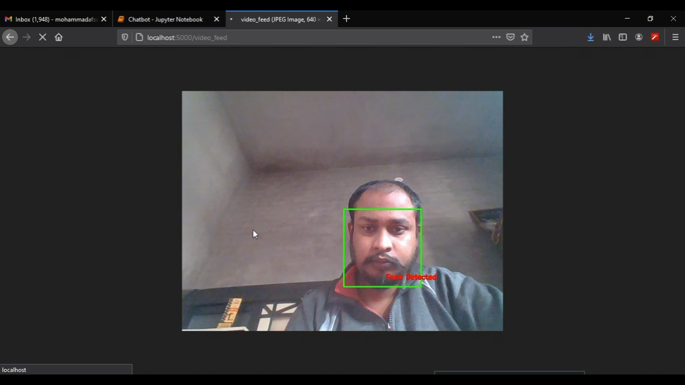

# face-detection-with-flask

## Quick Start Using Pip
----------------------------------------------------------------------------------------------------------------------------------------------------------

``` bash

# Install dependencies
$ pip install -r requirements.txt

```
In this Project we are going to detect Faces With <strong>HAAR CASCADE</strong> which detect Multi faces from live camera and detect all the faces in the frame<br>
----------------------------------------------------------------------------------------------------------------------------------------------------------

# Haar Cascade

Object Detection using Haar feature-based cascade classifiers is an effective object detection method proposed by Paul Viola and Michael Jones<br>
in their paper, “Rapid Object Detection using a Boosted Cascade of Simple Features” in 2001.<br>
It is a machine learning based approach where a cascade function is trained from a lot of positive and negative images.<br>
It is then used to detect objects in other images.<br>

the algorithm needs a lot of positive images (images of faces) and negative images (images without faces) to train the classifier.<br>
Then we need to extract features from it. For this, haar features shown in below image are used. They are just like our convolutional kernel.
Each feature is a single value obtained by subtracting sum of pixels under white rectangle from sum of pixels under black rectangle.
   
----------------------------------------------------------------------------------------------------------------------------------------------------------

### we are deploying it locally using Flask Framework 

Flask is a micro web framework written in Python. It is classified as a microframework because it does not require particular tools or libraries.<br>
It has no database abstraction layer, form validation, or any other components where pre-existing third-party libraries provide common functions.<br>
However, Flask supports extensions that can add application features as if they were implemented in Flask itself. <br>
Extensions exist for object-relational mappers, form validationvarious open authentication technologies and several common framework related tools

----------------------------------------------------------------------------------------------------------------------------------------------------------

# Face Detection 

Face detection can be regarded as a specific case of object-class detection. In object-class detection,<br>
the task is to find the locations and sizes of all objects in an image that belong to a given class. Examples include upper torsos, pedestrians, and cars.

Face-detection algorithms focus on the detection of frontal human faces. <br>
It is analogous to image detection in which the image of a person is matched bit by bit. Image matches with the image stores in database.<br>
Any facial feature changes in the database will invalidate the matching process

----------------------------------------------------------------------------------------------------------------------------------------------------------


``` bash
## Run Program 
> python main_.py
```
----------------------------------------------------------------------------------------------------------------------------------------------------------



